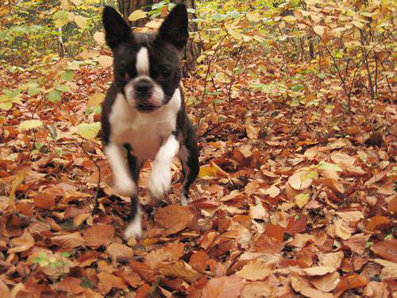
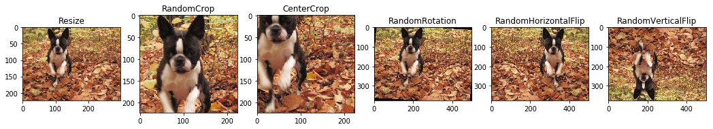

# Kaggle Dog Breed Transfer Learning in Pytorch
This repo is about transfer learning in pytorch for kaggle dog breed playground

> This notebook displays the step to use pretrained imagenet models for transfer learning in Dog Breed Identification playground on Kaggle.
Data can be downloaded from [Dog Breed Identification](https://www.kaggle.com/c/dog-breed-identification/data).

1. How data is arranged
3. Custom dataloader for this dataset
4. Some image transformations
5. Finetune Resnet50 with 224x224 image size
6. Finetune Resnet50 with 450x450 image size

### Custom dataset
```python
class CustomDataset(Dataset):
    def __init__(self, labels_df, img_path, transform=None):
        self.labels_df = labels_df
        self.img_path = img_path
        self.transform = transform

    def __len__(self):
        return self.labels_df.shape[0]

    def __getitem__(self, idx):
        image_name = os.path.join(self.img_path, self.labels_df.id[idx]) + '.jpg'
        img = Image.open(image_name)
        label = self.labels_df.label_idx[idx]

        if self.transform:
            img = self.transform(img)
        return img, label
```

### Image Transformations
```python
tfms_resize = transforms.Resize(224)
tfms_random_crop = transforms.RandomCrop(224)
tfms_center_crop = transforms.CenterCrop(224)
tfms_random_rotate = transforms.RandomRotation(10)
tfms_hflip = transforms.RandomHorizontalFlip()
tfms_vflip = transforms.RandomVerticalFlip()
```
Original Image



Trasformed images


### TODO
- [ ] Add method for test data prediction
- [ ] Add test time augmentation
